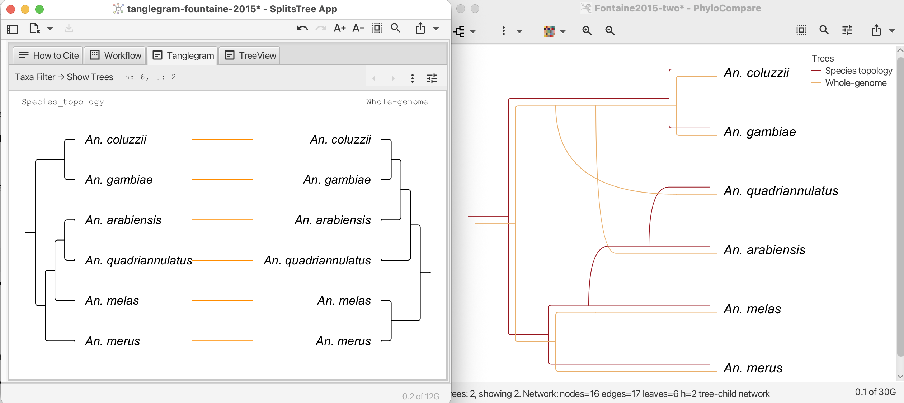
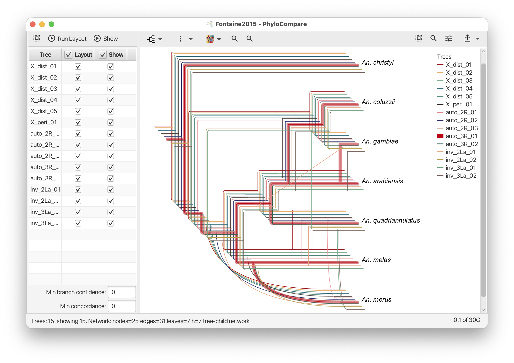

# PhyloParallelgrams User Manual

**Version 1.1.1**
**Daniel H. Huson, 2026**

> *Keyboard shortcuts:* throughout this manual, `Cmd` denotes the platform shortcut modifier - Cmd on macOS, Ctrl on
> Windows and Linux.

--

PhyloParallelgrams author: Daniel H. Huson
Contributors: Banu Cetinkaya (tree tracing in PhyloFusion) and Louxin Zhang (PhyloFusion algorithm)

## 1. Introduction

PhyloParallelgrams is a JavaFX desktop application for computing and displaying a **(phylogenetic) Parallelogram**, that
is a
new type of tree comparison that draws two or more trees co-located in parallel to show where they have the same
topology and where they differ.

Under the hood, PhyloParallelgrams uses the **PhyloFusion** algorithm to compute an underlying rooted network that
contains
all trees and aims at minimizing the number of required reticulations. The parallelogram is then obtained by tracing
each input tree through this network and drawing the resulting embeddings side-by-side, so that shared edges line up and
disagreements stand out as divergent branches.

### What is a phylogenetic parallelogram?

A phylogenetic parallelogram can be viewed as a generalization of a tanglegram. Rather than drawing two trees separately
and connecting corresponding taxa by lines, PhyloParallelgrams first computes a rooted network that contains all input
trees
and then draws each tree as an embedding inside this common structure. This causes topologically identical regions of
different trees to align automatically, while disagreements appear as visibly diverging branches.

Figure 1 compares a traditional tanglegram with the corresponding phylogenetic parallelogram. The tanglegram (left)
connects matching taxa by line segments, whereas the parallelogram (right) draws both trees within a common network,
making topological agreement and disagreement much easier to identify.

### Tanglegram versus phylogenetic parallelogram

**Figure 1.** A traditional tanglegram (left) and the corresponding phylogenetic parallelogram (right). The
parallelogram is obtained by embedding both trees into a common rooted network and drawing the embeddings in parallel.

Phylogenetic parallelograms become particularly useful when comparing more than two trees. Figure 2 shows a
parallelogram constructed from fifteen trees derived from different genomic regions. Even though many trees are
displayed simultaneously, the shared structure remains visually aligned, while regions of disagreement can be identified
by the divergence of the colored traces.

### Phylogenetic parallelogram for fifteen trees

**Figure 2.** A phylogenetic parallelogram containing fifteen trees. Each color corresponds to one input tree. Shared
topology is represented by aligned paths, whereas alternative evolutionary histories appear as diverging traces within
the underlying network. Individual trees can be highlighted as shown.

Typical use cases:

- **Comparing alternative phylogenies** of the same set of taxa - for example, gene trees from different loci, or trees
  inferred under different models or methods (ML vs. Bayesian, different partitionings) - and seeing at a glance where
  they agree and where they disagree.
- **Locating sources of incongruence**: regions of the parallelogram where the trees split apart pinpoint clades whose
  placement is unstable, and correspond directly to the reticulations in the underlying network.
- **Communicating phylogenetic results** in talks, papers, and teaching, where a single parallelogram conveys
  topological agreement across multiple trees far more clearly than a row of separately drawn trees.
- **Producing publication-quality figures** of the parallelogram and its underlying network in several diagram styles (
  rectangular, circular, radial; cladogram or phylogram).

### Key features

- Parallelogram visualization of two or more rooted trees on overlapping taxon sets, with shared structure aligned and
  disagreements made visually explicit.
- Interactive tree table for selecting which trees contribute to the underlying network and which are shown in the
  parallelogram.
- Color-coded tree overlays with an automatically generated legend.
- Confidence-based filtering of input tree branches before computation.
- Six diagram layouts (rectangular, circular, or radial; cladogram or phylogram).
- Optional rendering of transfer edges and outline-style display of the underlying network.
- Advanced PhyloFusion settings - reticulation placement and branch-length fitting - accessible from a settings panel.
- Export to image (PNG, SVG, PDF) and data (extended Newick) formats; copy taxa, trees, network, or image to the
  clipboard.

## 2. Installation

Installers are available here:
`https://github.com/husonlab/phyloparallelgrams/releases/`

## 3. The main window at a glance

The main window is split vertically into two panels:

| Panel                           | Purpose                                                                                                                                             |
|---------------------------------|-----------------------------------------------------------------------------------------------------------------------------------------------------|
| **Left - Tree table**           | Lists all loaded input trees. Two checkbox columns control which trees are used in the PhyloFusion layout and which are drawn in the parallelogram. |
| **Right - Visualization panel** | Displays the computed rooted network together with the phylogenetic parallelogram drawn over it.                                                    |

A status bar at the bottom shows progress messages and a live memory-usage indicator.

### 3.1 Tree table (left panel)

The table has three columns:

- **Tree** - the name (and optional metadata) of each input tree.
- **Layout** - checkbox: include this tree when running PhyloFusion layout.
- **Show** - checkbox: include this tree in the parallelogram drawn on the network.

Above the table:

- **Select all** / **Select none** - toggle the selection state of all rows in the table.
- **Run Layout** - run the PhyloFusion algorithm on the trees whose *Layout* box is checked.
- **Show** - refresh the parallelogram to include exactly the trees whose *Show* box is checked.

Below the table:

- **Min branch confidence (%)** - a spinner (range 0-100, step 1; you can also type a value such as `50.5`). Input
  branches with confidence values below this percentage are pruned from each input tree before PhyloFusion is run. Set
  to `0` to disable filtering.

- **Min branch concordance (%)** - a spinner (range 0-100, step 1). Input branches supported by fewer than this
  percentage of the input trees are pruned before PhyloFusion is run. Set to `0` to disable filtering.

### 3.2 Visualization panel (right panel)

The right panel renders the computed rooted network and, on top of it, the phylogenetic parallelogram formed by the
trees whose *Show* box is checked. Its toolbar contains:

- **Diagram** - opens a menu for choosing the diagram type (see Section 6.4).
- **Settings** - opens a menu with rendering options:
    - *Show Outline* - show the outline the underlying network.
    - *Spread* spinner - controls the spread of the trees drawn in the parallelogram.
    - *Curved Reticulate Edges* - draw reticulation edges as curves rather than rectangular segments.
    - *Use Transfer Edges* - use horizontal-transfer-style edges in addition to standard reticulation edges.
    - *Min Percent* spinner - minimum percentage of trees that must use an edge for it to qualify as a transfer acceptor
    edge.
- **Color scheme** - drop-down menu of color schemes used to color the trees in the parallelogram.
- **Zoom In Vertically** - zoom the view in vertically by one step.
- **Zoom Out Vertically** - zoom the view out vertically by one step.
- **Zoom In Horizontally** - zoom the view in horizontally by one step.
- **Zoom Out Horizontally** - zoom the view out horizontally by one step.

Further to the right in the same toolbar:

- **Find** - toggle a find bar (shown below the toolbar) for searching trees in the table and taxa in the network. Its
  state mirrors *Edit > Find...*.
- **Format** - toggle the settings panel described in Section 3.3.
- **Export** - a menu button with shortcuts to:
    - *Copy Taxa* - copy the selected taxon labels to the clipboard.
    - *Copy Trees* - copy the currently selected input trees to the clipboard (Newick).
    - *Copy Network* - copy the underlying network to the clipboard (extended Newick).
    - *Copy Image* - copy the current visualization to the clipboard as an image.
    - *Print...* - print the current view.
    - *Export Image...* - save the visualization as an image (PNG, SVG, PDF), cropped to its content.
    - *Export Data...* - export the computed network (or the selected trees) in extended Newick format.

When the window is too narrow to show every toolbar button, the right-most buttons collapse into a `>>` overflow menu.

A floating legend (top right) shows the color assigned to each tree in the parallelogram; toggle it with *View > Show
Trees Legend* (the setting is remembered between sessions).

### 3.3 Taxon-label and PhyloFusion settings panel

The **Format** button (the *tune* icon) in the visualization panel toggles a floating panel that overlays the top
right
of the network view. The panel is an accordion with two sections; click a section header to expand it:

- **Taxon Labels** - change the font, size, and color of the taxon labels drawn on the network.

- **PhyloFusion Settings** - advanced options that control how the underlying network is computed. Changes take effect
  the next time you run the layout (**Run Layout**, or **Layout > Run PhyloFusion Layout**, `Cmd+R`):

    - **Reticulations** - when several networks are equally good, which subnetwork to place below each reticulate node.
      *Normal* (the default) avoids *shortcut* reticulate edges (edges whose source is an ancestor of their target);
      *Smallest* and *Largest* place the subnetwork with the fewest, respectively most, taxa below each reticulate node;
      *None* simply reports the first network found.
    - **Edge weights** - how the branch lengths of the network are fitted from the input-tree branch lengths.
      *LeastSquares* (the default) is a non-negative least-squares fit; *Average* averages the contributing tree
      branches; *LeastAbsolute* is a least-absolute-deviation (L1) fit; *LeastAbsoluteZeroReticulations* is an L1 fit
      that forces every reticulate edge to length zero; *None* leaves the branch lengths unset.
    - **Mutual refinement** - mutually refine the input trees before running PhyloFusion.
    - **Group non-separated taxa** - group taxa that are never separated by any input tree, to speed up the computation.
    - **Missing-taxa heuristic** - apply a heuristic that can reduce the number of reticulations when the input trees do
      not all contain the same taxa.

  The default settings (*Normal* reticulations, *LeastSquares* edge weights) are appropriate for most datasets; the
  remaining options are provided for advanced users.

A separate **Note** button (the *sticky-note* icon) toggles a floating note in the top left of the view, in which you
can
record a description of the dataset (for example, the paper it came from). The note is saved with the document.

## 4. Loading and saving data

### 4.1 Supported input formats

- **Newick** - one rooted tree per line (or one tree per `;`-terminated block). This is the primary input format.
- **Nexus** - a file in Nexus format containing a list of trees.
- **Tree names** - a plain-text list of tree labels, importable via *File > Import > Tree Names...* (used to label
  trees that were loaded from a source that did not provide names).

(Note on advanced usage: The entries in a Newick or Nexus are expected to be trees. However, if the file contains
exactly one item that is a rooted
phylogenetic network that contains `TT` node and edge annotations, then this will be interpreted as a rooted network
that has embedded trees.)

### 4.2 Opening files

- **File > New...** (`Cmd+N`) - open a new, empty PhyloParallelgrams window.
- **File > Open...** (`Cmd+O`) - open a file containing one or more rooted trees.
- **File > Recent** - re-open a recently used file.

### 4.3 Saving and exporting

- **File > Save...** (`Cmd+S`) - save the current session (input trees, run settings, computed network, parallelogram
  selection, and the dataset note) to a PhyloParallelgrams document with file extension `phypar`.
- **File > Export > Image...** - save the current visualization (network plus parallelogram) as an image, cropped to
  its content. Supported image formats: PNG, SVG and PDF.
- **File > Export > Data...** - export the computed network (or the selected trees) in extended Newick format.
- **File > Page Setup...** / **File > Print...** (`Cmd+P`) - printing.

## 5. A typical workflow

1. **File > Open...** a file containing your rooted input trees.
2. The trees appear in the table on the left. By default, the first are checked in both the *Run* and *Show* columns,
   and are displayed together on the right.
3. (Optional) Set a **Min branch confidence** value to prune low-support branches before running PhyloFusion.
4. (Optional) Use **Select None** and then check only the trees you want to include in the analysis.
5. Click **Run Layout** (or **Layout > Run PhyloFusion Layout**, `Cmd+R`).
6. The computed rooted network appears in the right-hand panel, with the parallelogram of all *Show*-checked trees drawn
   on top.
7. Adjust which trees appear in the parallelogram using the *Show* checkboxes in the table, then click **Show** (or *
   *Run > Show Selected Trees**).
8. Tune the visual appearance via the **Diagram** and **Settings** menus.
9. Export the figure via **File > Export > Image...** or copy it to the clipboard from the *Export* menu in the
   visualization panel.

## 6. Menu reference

### 6.1 File menu

| Item                   | Shortcut | Action                                        |
|------------------------|----------|-----------------------------------------------|
| New...                 | `Cmd+N`  | Open an empty window.                         |
| Open...                | `Cmd+O`  | Open a file of rooted input trees.            |
| Recent                 | -        | Recently opened files.                        |
| Import > Tree Names... | -        | Import a list of tree names.                  |
| Export > Image...      | -        | Export the current visualization as an image. |
| Export > Data...       | -        | Export trees or network in extended Newick format. |
| Save...                | `Cmd+S`  | Save the current session.                     |
| Page Setup...          | -        | Configure print page settings.                |
| Print...               | `Cmd+P`  | Print the current view.                       |
| Close                  | `Cmd+W`  | Close the current window.                     |
| Quit                   | `Cmd+Q`  | Exit PhyloParallelgrams.                      |

### 6.2 Edit menu

Standard editing commands: **Undo** (`Cmd+Z`), **Redo** (`Shift+Cmd+Z`), **Cut** (`Cmd+X`), **Copy** (`Cmd+C`), **Copy
Image** (`Shift+Cmd+C`), **Paste** (`Cmd+V`), **Delete** (`Backspace`), **Clear**, **Find...** (`Cmd+F`), **Find Again
** (`Cmd+G`).

Use Find to search for trees in the input table and taxa in the network. The following special search terms can also be
used:

run:true, run:false, show:true, show:false and size:integer, where size is the number of taxa in the tree.

Additional edit menu items:

| Item               | Shortcut | Action                                                                                            |
|--------------------|----------|---------------------------------------------------------------------------------------------------|
| Reroot by Outgroup | -        | If any taxa in the network are selected, reroot all input trees using the selected taxa as output |
| Reroot by Midpoint | -        | Reroot all input trees using midpoint rooting.                                                    |
| Remove taxa        | -        | Remove all selected taxa.                                                                         |

### 6.3 Layout menu

| Item                         | Shortcut | Action                                                                                                                                                                                  |
|------------------------------|----------|-----------------------------------------------------------------------------------------------------------------------------------------------------------------------------------------|
| Use All Trees                | -        | Check every (selected) tree's *Run* box.                                                                                                                                                |
| Use None Trees               | -        | Uncheck every (selected) tree's *Run* box.                                                                                                                                              |
| Run PhyloFusion Layout       | `Cmd+R`  | Run PhyloFusion layot on the selected input trees.                                                                                                                                      |
| Show All Trees               | -        | Check every (selected) tree's *Show* box.                                                                                                                                               |
| Show None Trees              | -        | Uncheck every (selected)  tree's *Show* box.                                                                                                                                            |
| Show Selected Trees          | -        | Redraw the parallelogram using only the trees with *Show* checked.                                                                                                                      |
| Show Trees Exhaustive        | -        | Use an exhaustive (brute-force) algorithm to locate all trees in the network. The exhaustive algorithm is also used to embed trees that were not used to compute the underlying network |
| Set Confidence Threshold...  | -        | Open a dialog to set the *Minimum branch confidence* value.                                                                                                                             |
| Set Concordance Threshold... | -        | Open a dialog to set the *Minimum branch concordance* value. This is the minimum percentage of trees that an edge has to be compatible with to be included.                             |

### 6.4 View menu

- **Enter Full Screen** (`Ctrl+Cmd+F`)
- **Use Dark Theme** - toggle between light and dark UI themes.
- **Increase / Decrease Font Size** (`Shift+Cmd+Up` / `Shift+Cmd+Down`)
- **Zoom In / Out / To Fit** (`Cmd+Up` / `Cmd+Down` / `Cmd+.`)
- **Diagram Type** - choose one of:
    - Rectangular Cladogram
    - Rectangular Phylogram
    - Circular Cladogram
    - Circular Phylogram
    - Radial Cladogram
    - Radial Phylogram
- **Flip Vertically** - flip the drawing vertically.
- **Show Outline** - render in outline mode.
- **Show Trees Legend** - show or hide the floating color legend. The choice is remembered between sessions.
- **Curved Reticulate Edges** - draw reticulation edges as curves.
- **Use Transfer Edges** - Use and display transfer-style edges.
- **Set Acceptor Min Percent...** - Minimum percent of trees that have to use a reticulate edge so that it
  is declared the transfer acceptor edge - all other edges leading to the target of that edge are then intepreted as
  transfer edges.
  (since 1.0.3)

### 6.5 Window menu

- **Set Window Size...** - open a dialog to enter exact pixel dimensions for the window. Useful when preparing figures
  for a specific output size.

### 6.6 Help menu

- **Check for Updates...** - query the update server.
- **About...** - version and citation information.
- **Open User Manual in Browser...** - open this manual in a webbrowser.

## 7. The PhyloFusion algorithm

Given a collection of rooted phylogenetic trees that may include multifurcations,
the PhyloFusion algorithm computes a rooted phylogenetic network N that displays all input trees and attempts to
minimizes the hybridization number h(N).

## 8. The phylogenetic parallelogram

The *phylogenetic parallelogram* is the central visualization in PhyloParallelgrams.
A given set of rooted input trees are drawn in parallel in the same coordinate frame,
guided by an underlying rooted network *N* (computed by PhyloFusion).

The construction proceeds in three steps:

1. **Initial embeddings.** For each input tree *T* of the PhyloFusion algorithm, the algorithm reports which nodes and
   reticulate edges in the network correspond to the tree.
2. **Additional embeddings.** For each additional tree *T* to be displayed, a brute-force algorithm is used to determine
   if and how *T* in contained in *N*.
3. **Co-display.** The embeddings of all *Show*-checked trees are drawn together on top of *N*, each in its own color
   from the active color scheme. Where two or more trees agree on an edge, the embeddings are parallel; where they
   disagree, they fan out and the divergence becomes visually obvious.
   This is what makes the picture a *parallelogram*: shared topology lines up, while disagreement creates parallel
   branches.

The legend in the top right of the visualization panel shows the color assigned to each tree currently included in the
parallelogram.

## 9. Citation

If you use PhyloParallelgrams in published work, please cite:

- Huson, D. H., B. Cetinkaya and L. Zhang. PhyloParallelgrams: visualizing agreement and conflict among trees as
  phylogenetic
  parallelograms, submitted.

and the underlying PhyloFusion paper:

- L. Zhang, B. Cetinkaya, D. H. Huson (2026) PhyloFusion—Fast and Easy Fusion of Rooted Phylogenetic Trees into Rooted
  Phylogenetic Networks, Systematic Biology, 75(1):88-99,
  2026 [https://doi.org/10.1093/sysbio/syaf049](https://doi.org/10.1093/sysbio/syaf049)

This is the paper that describes how the layout of the underlying network is computed:

- Huson DH (2025) Sketch, capture and layout phylogenies. PLOS Computational Biology 21(12):
  e1013805. [https://doi.org/10.1371/journal.pcbi.1013805](https://doi.org/10.1371/journal.pcbi.1013805)

## 10. License

PhyloParallelgrams is released under the **GNU General Public License, version 3 or later** (GPL-3.0-or-later). See
the `LICENSE` file shipped with the distribution, or https://www.gnu.org/licenses/.

--

*Manual last updated: September 2026.*
